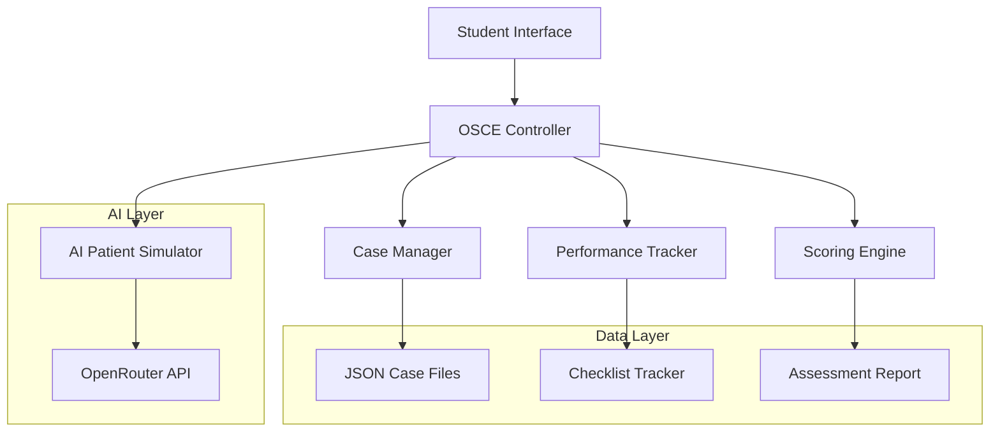
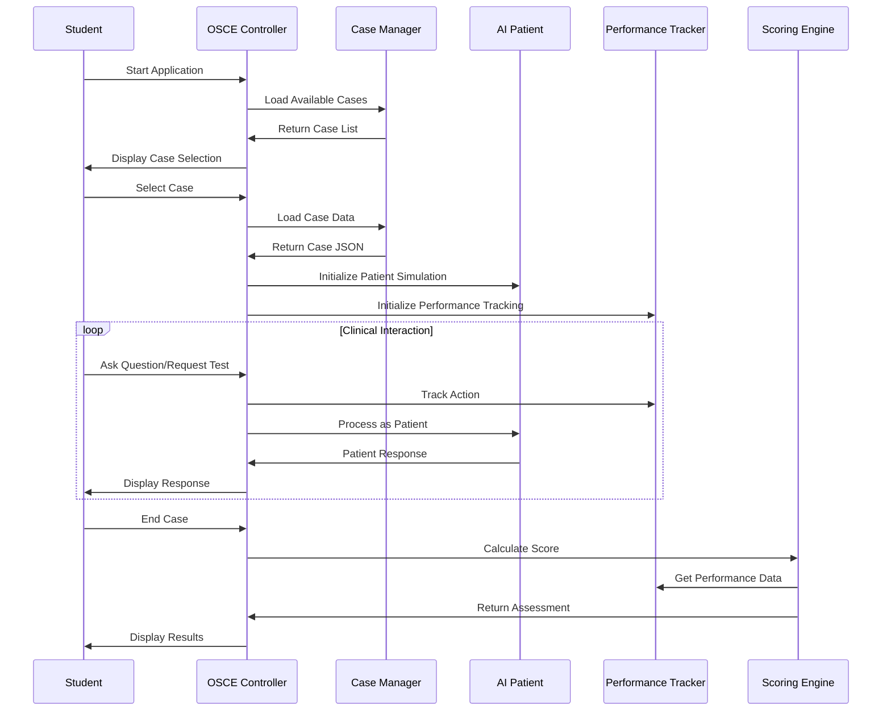

# OSCE Medical App Design Document

## Overview

The OSCE Medical App extends the existing OpenRouter chat application to provide structured clinical examination training. The system transforms a general-purpose chatbot into a specialized medical education platform where AI simulates patients, tracks student performance, and provides automated assessment.

The application maintains the existing chat infrastructure while adding case management, performance tracking, and specialized medical AI prompting to create an immersive clinical training experience.

## Architecture

### High-Level Architecture



### Application Flow



## Components and Interfaces

### 1. OSCE Controller (Main Application Logic)

**Purpose:** Central coordinator that manages the application flow and user interactions.

**Key Methods:**
- `startOSCE()`: Initialize the application and display case selection
- `selectCase(caseId)`: Load and start a specific case
- `processUserInput(input)`: Handle student interactions and route to appropriate handlers
- `endCase()`: Trigger scoring and display results

**Interfaces:**
- Extends existing readline interface for user input
- Integrates with existing OpenRouter API calling mechanism
- Manages application state transitions

### 2. Case Manager

**Purpose:** Handles loading, parsing, and managing clinical case data.

**Key Methods:**
- `loadAvailableCases()`: Scan and load all case JSON files
- `getCaseById(id)`: Retrieve specific case data
- `validateCaseData(caseData)`: Ensure case JSON has required fields
- `getCaseList()`: Return formatted list of available cases

**Data Structure:**
```javascript
{
  id: "stemi-001",
  title: "Acute Coronary Syndrome - STEMI",
  chiefComplaint: "Chest pain for 2 hours",
  patientInfo: {
    age: 58,
    gender: "male",
    name: "John Smith"
  },
  // ... additional case data
}
```

### 3. AI Patient Simulator

**Purpose:** Manages AI prompting to simulate realistic patient interactions.

**Key Methods:**
- `initializePatient(caseData)`: Set up patient persona and medical history
- `respondAsPatient(userInput, caseData)`: Generate contextual patient responses
- `shouldRevealInformation(requestType, caseData)`: Determine if information should be disclosed
- `formatMedicalResponse(data, requestType)`: Format medical data appropriately

**Prompting Strategy:**
- System prompt establishes patient persona and medical condition
- Context includes case-specific symptoms, history, and examination findings
- Response filtering based on what information should be available when requested

### 4. Performance Tracker

**Purpose:** Monitors student actions and maps them to checklist items.

**Key Methods:**
- `initializeChecklist(caseData)`: Set up tracking for case-specific checklist
- `trackAction(userInput, actionType)`: Record and categorize student actions
- `markChecklistItem(itemId)`: Mark specific checklist items as completed
- `getCompletionStatus()`: Return current progress on checklist
- `getDetailedLog()`: Return comprehensive action log

**Tracking Categories:**
- History taking (anamnesis)
- Physical examination requests
- Laboratory test orders
- Imaging study requests
- Diagnostic reasoning
- Treatment planning

### 5. Scoring Engine

**Purpose:** Calculates performance scores and generates detailed feedback.

**Key Methods:**
- `calculateScore(performanceData, checklist)`: Compute numerical score
- `generateFeedback(performanceData, checklist)`: Create detailed assessment report
- `identifyMissedItems(checklist)`: Highlight uncompleted critical items
- `provideLearningPoints(missedItems)`: Generate educational feedback

**Scoring Algorithm:**
- Weighted scoring based on item importance (critical, important, optional)
- Bonus points for efficiency and appropriate sequencing
- Deductions for inappropriate requests or missed critical items

## Data Models

### Case JSON Schema

```json
{
  "id": "stemi-001",
  "title": "Acute Coronary Syndrome - STEMI",
  "description": "58-year-old male with acute chest pain",
  "chiefComplaint": "Severe chest pain for 2 hours",
  "patientInfo": {
    "age": 58,
    "gender": "male",
    "name": "John Smith",
    "occupation": "Construction worker"
  },
  "presentingSymptoms": {
    "primary": "Severe crushing chest pain",
    "associated": ["Shortness of breath", "Nausea", "Sweating"],
    "onset": "2 hours ago, sudden onset",
    "character": "Crushing, pressure-like",
    "radiation": "Left arm and jaw",
    "severity": "9/10"
  },
  "medicalHistory": {
    "pastMedical": ["Hypertension", "Diabetes mellitus type 2"],
    "medications": ["Metformin", "Lisinopril"],
    "allergies": ["NKDA"],
    "socialHistory": {
      "smoking": "20 pack-years, quit 5 years ago",
      "alcohol": "Occasional",
      "familyHistory": "Father died of MI at age 62"
    }
  },
  "physicalExamination": {
    "vitalSigns": {
      "bp": "160/95",
      "hr": "110",
      "rr": "22",
      "temp": "37.1",
      "o2sat": "94% on room air"
    },
    "general": "Diaphoretic, anxious, in moderate distress",
    "cardiovascular": "Tachycardic, regular rhythm, no murmurs",
    "respiratory": "Mild bibasilar crackles",
    "other": "Unremarkable"
  },
  "investigations": {
    "ecg": {
      "findings": "ST elevation in leads II, III, aVF; reciprocal changes in I, aVL",
      "interpretation": "Inferior STEMI"
    },
    "labs": {
      "troponin": "15.2 ng/mL (elevated)",
      "ck": "450 U/L (elevated)",
      "ckmb": "45 ng/mL (elevated)",
      "cbc": "WBC 12.5, Hgb 14.2, Plt 350",
      "bmp": "Na 140, K 4.2, Cl 102, CO2 24, BUN 18, Cr 1.1, Glucose 180"
    },
    "imaging": {
      "chestXray": "Mild pulmonary edema, normal heart size"
    }
  },
  "checklist": {
    "historyTaking": {
      "weight": 30,
      "items": [
        {
          "id": "onset_timing",
          "description": "Asked about onset and timing of chest pain",
          "critical": true,
          "points": 5
        },
        {
          "id": "pain_character",
          "description": "Characterized the chest pain (quality, severity, radiation)",
          "critical": true,
          "points": 5
        },
        {
          "id": "associated_symptoms",
          "description": "Asked about associated symptoms",
          "critical": false,
          "points": 3
        },
        {
          "id": "past_medical_history",
          "description": "Obtained relevant past medical history",
          "critical": false,
          "points": 3
        },
        {
          "id": "medications",
          "description": "Asked about current medications",
          "critical": false,
          "points": 2
        },
        {
          "id": "risk_factors",
          "description": "Assessed cardiovascular risk factors",
          "critical": true,
          "points": 4
        }
      ]
    },
    "physicalExamination": {
      "weight": 20,
      "items": [
        {
          "id": "vital_signs",
          "description": "Checked vital signs",
          "critical": true,
          "points": 5
        },
        {
          "id": "cardiovascular_exam",
          "description": "Performed cardiovascular examination",
          "critical": true,
          "points": 5
        },
        {
          "id": "respiratory_exam",
          "description": "Performed respiratory examination",
          "critical": false,
          "points": 3
        }
      ]
    },
    "investigations": {
      "weight": 25,
      "items": [
        {
          "id": "ecg",
          "description": "Ordered ECG",
          "critical": true,
          "points": 8
        },
        {
          "id": "cardiac_enzymes",
          "description": "Ordered cardiac enzymes/troponin",
          "critical": true,
          "points": 6
        },
        {
          "id": "basic_labs",
          "description": "Ordered basic metabolic panel and CBC",
          "critical": false,
          "points": 3
        },
        {
          "id": "chest_xray",
          "description": "Ordered chest X-ray",
          "critical": false,
          "points": 2
        }
      ]
    },
    "diagnosis": {
      "weight": 15,
      "items": [
        {
          "id": "primary_diagnosis",
          "description": "Correctly identified STEMI",
          "critical": true,
          "points": 10
        },
        {
          "id": "differential",
          "description": "Considered appropriate differential diagnoses",
          "critical": false,
          "points": 5
        }
      ]
    },
    "management": {
      "weight": 10,
      "items": [
        {
          "id": "emergency_treatment",
          "description": "Initiated appropriate emergency treatment",
          "critical": true,
          "points": 8
        },
        {
          "id": "cardiology_consult",
          "description": "Arranged urgent cardiology consultation",
          "critical": true,
          "points": 2
        }
      ]
    }
  },
  "expectedDiagnosis": "ST-elevation myocardial infarction (STEMI) - inferior wall",
  "learningObjectives": [
    "Recognize classic presentation of STEMI",
    "Perform systematic cardiovascular assessment",
    "Order appropriate diagnostic tests",
    "Initiate time-sensitive emergency treatment"
  ]
}
```

### Performance Tracking Data Structure

```javascript
{
  caseId: "stemi-001",
  studentActions: [
    {
      timestamp: "2024-01-15T10:30:00Z",
      input: "Can you tell me about your chest pain?",
      category: "history_taking",
      checklistItems: ["onset_timing", "pain_character"]
    }
  ],
  checklistStatus: {
    "onset_timing": { completed: true, timestamp: "2024-01-15T10:30:00Z" },
    "pain_character": { completed: true, timestamp: "2024-01-15T10:30:00Z" }
  },
  score: {
    total: 85,
    breakdown: {
      "historyTaking": 25,
      "physicalExamination": 13,
      "investigations": 20,
      "diagnosis": 15,
      "management": 10
    }
  }
}
```

## Error Handling

### Case Loading Errors
- **Missing case files**: Display user-friendly message and continue with available cases
- **Malformed JSON**: Log error details and skip invalid cases
- **Missing required fields**: Validate and provide specific error messages

### AI API Errors
- **Network failures**: Implement retry logic with exponential backoff
- **Rate limiting**: Queue requests and implement appropriate delays
- **Invalid responses**: Fallback to generic patient responses

### User Input Validation
- **Empty inputs**: Prompt for clarification
- **Inappropriate requests**: Guide student toward appropriate clinical actions
- **System commands**: Handle special commands (exit, score, help) appropriately

## Testing Strategy

### Unit Testing
- **Case Manager**: Test JSON loading, validation, and data retrieval
- **Performance Tracker**: Verify action tracking and checklist mapping
- **Scoring Engine**: Validate score calculations and feedback generation

### Integration Testing
- **AI Patient Simulation**: Test realistic patient responses across different case scenarios
- **End-to-end workflows**: Verify complete case execution from selection to scoring
- **Error scenarios**: Test graceful handling of various failure conditions

### Medical Content Validation
- **Clinical accuracy**: Review case content with medical professionals
- **Checklist completeness**: Ensure checklists cover essential clinical skills
- **Educational value**: Validate learning objectives and feedback quality

### Performance Testing
- **Response times**: Ensure AI responses are delivered within acceptable timeframes
- **Memory usage**: Monitor application performance during extended sessions
- **Concurrent usage**: Test multiple simultaneous case sessions (future consideration)