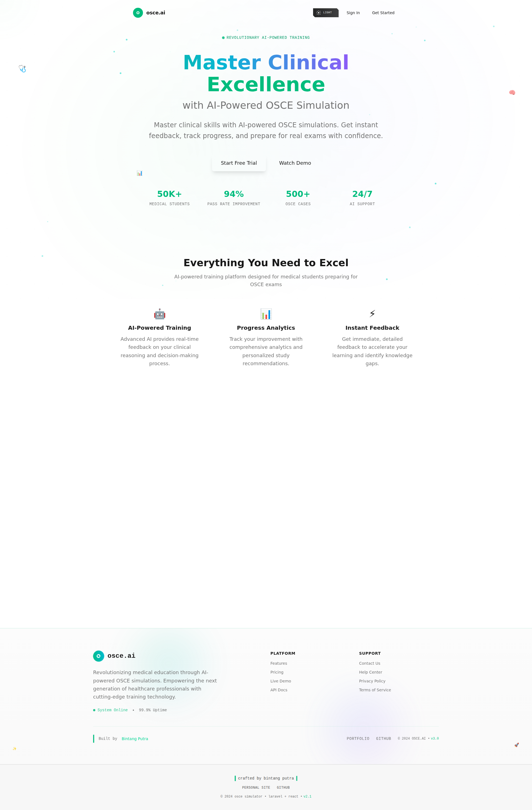

# Web-Based OSCE Training Platform

A modern web application for Objective Structured Clinical Examination (OSCE) training, featuring AI-powered patient simulation, community forums, and assessment tools.

Migration notice: We are actively migrating the frontend from Vue 3 to React using the Vibe UI KIT. The app currently runs with Vue via Inertia in many areas while new/updated screens are being implemented in React (Inertia React + Vite). Expect mixed frontend stacks during this transition.

Notes during React migration
- New UI should use React with Inertia React and Vite; legacy pages remain in Vue until migrated.
- Component library: Vibe UI KIT (React). For legacy Vue pages, shadcn-vue remains in place.

## 🏥 Features

- **AI Patient Simulation** - Interactive conversations with AI patients powered by Google Gemini
- **OSCE Case Library** - Clinical cases with structured objectives and difficulty levels
- **Session Tracking** - Progress monitoring and performance analytics

## 📸 Screenshots

### Landing Page


### Dashboard Interface


## 🛠 Technology Stack

- **Backend**: Laravel 12 (PHP 8.2+)
- **Frontend**: Vue 3 + Inertia (current), React + Inertia (in progress) using Vibe UI KIT
- **Styling**: Tailwind CSS v4; shadcn-vue (legacy), Vibe UI KIT (React)
- **Testing**: Pest + PHPUnit
- **Database**: PostgreSQL (production) / SQLite (development)

## 🧱 Project Structure

The main application is located in the `webapp/` directory following standard Laravel conventions:

```
webapp/
├── app/                    # Laravel application logic
│   ├── Models/            # Eloquent models (User, OsceCase, Post, etc.)
│   └── Http/Controllers/  # Request handlers
├── resources/js/          # Vue 3 frontend
│   ├── Pages/            # Inertia page components
│   ├── Components/       # Reusable Vue components
│   └── Layouts/          # Application layouts
├── database/             # Migrations, seeders, factories
├── routes/               # Application routes
└── tests/                # Test suites
```
