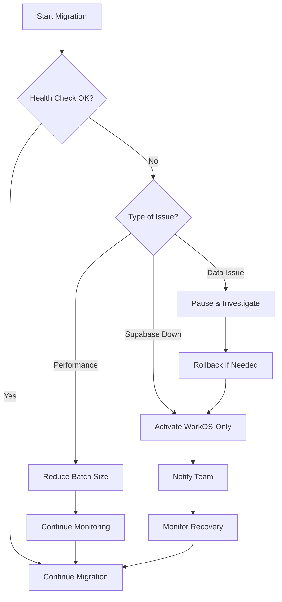

# Supabase Migration Fallback Plan

## Executive Summary

This document outlines the fallback strategies and emergency procedures for the WorkOS to Supabase authentication migration. The goal is to ensure business continuity and minimal user impact in case of migration failures.

## Risk Assessment

### High-Risk Scenarios

1. **Supabase Service Outage**
   - Complete authentication failure for migrated users
   - Impact: Critical - Users cannot access the application

2. **Data Corruption During Migration**
   - User records partially updated
   - Impact: High - Some users may have authentication issues

3. **OAuth Provider Issues**
   - Social login failures
   - Impact: Medium - Users cannot log in with social accounts

4. **Performance Degradation**
   - Slow authentication responses
   - Impact: Medium - Poor user experience

## Fallback Strategies

### Strategy 1: Immediate Rollback (T+0)

**Trigger**: Any critical issue during migration

```bash
# 1. Disable Supabase authentication
echo "USE_SUPABASE_AUTH=false" >> .env
echo "SUPABASE_DUAL_MODE=false" >> .env

# 2. Clear cache
php artisan cache:clear
php artisan config:clear

# 3. Restart services
php artisan queue:restart
php artisan serve
```

### Strategy 2: WorkOS-Only Mode (T+5 minutes)

**Trigger**: Supabase instability or API issues

1. Update environment variables:
```env
USE_SUPABASE_AUTH=false
SUPABASE_DUAL_MODE=false
WORKOS_ONLY_MODE=true
```

2. Update authentication middleware to bypass Supabase checks

### Strategy 3: Read-Only Mode (T+15 minutes)

**Trigger**: Persistent authentication issues

1. Enable read-only mode:
```php
// in app/Http/Middleware/TrustProxies.php
if (config('app.maintenance_mode')) {
    return redirect('/maintenance');
}
```

2. Display maintenance page

### Strategy 4: Graceful Degradation (T+30 minutes)

**Trigger**: Partial functionality issues

1. Disable non-critical features:
   - Social login
   - Password reset
   - User registration

2. Keep core authentication working

## Emergency Procedures

### Pre-Migration Checklist

Before starting migration, ensure:

- [ ] Database backup completed
- [ ] WorkOS credentials backed up
- [ ] Environment file backed up
- [ ] Team contact list updated
- [ ] Monitoring tools in place
- [ ] Fallback scripts tested

### During Migration Monitoring

Monitor these metrics:
1. **Authentication Success Rate**
   ```bash
   # Monitor failed authentications
   tail -f storage/logs/laravel.log | grep -i "authentication failed"
   ```

2. **Database Performance**
   ```bash
   # Check slow queries
   php artisan tinker
   >>> DB::select('SELECT * FROM mysql.slow_log');
   ```

3. **Supabase API Response Time**
   ```bash
   # Test API response
   curl -w "@curl-format.txt" -o /dev/null -s "$SUPABASE_URL/auth/v1/user"
   ```

### Failure Response Flow

1. **Detect Failure**
   - Automated alerts trigger
   - Error rate > 5% for 5 minutes
   - Team notification via Slack/Email

2. **Assess Impact**
   - Determine affected users
   - Estimate resolution time
   - Choose appropriate fallback strategy

3. **Execute Fallback**
   - Run predefined scripts
   - Update configuration
   - Verify service restoration

4. **Communicate**
   - Internal team notification
   - User communication (if needed)
   - Stakeholder updates

## Fallback Scripts

### Script 1: Emergency Rollback

```bash
#!/bin/bash
# scripts/emergency-rollback.sh

echo "🔄 Starting emergency rollback..."

# Backup current state
cp .env .env.backup-$(date +%Y%m%d-%H%M%S)

# Reset to WorkOS-only
sed -i 's/USE_SUPABASE_AUTH=.*/USE_SUPABASE_AUTH=false/' .env
sed -i 's/SUPABASE_DUAL_MODE=.*/SUPABASE_DUAL_MODE=false/' .env

# Clear caches
php artisan cache:clear
php artisan config:clear
php artisan route:clear

# Reset migration status in database
php artisan tinker --execute="
    \App\Models\User::query()->update([
        'is_migrated' => false,
        'supabase_id' => null
    ]);
    echo 'Migration status reset';
"

# Restart queue workers
php artisan queue:restart

echo "✅ Rollback complete!"
```

### Script 2: Health Check

```bash
#!/bin/bash
# scripts/health-check.sh

# Check authentication endpoints
ENDPOINTS=(
    "/login"
    "/auth/supabase/login"
    "/auth/supabase/callback"
)

for endpoint in "${ENDPOINTS[@]}"; do
    status_code=$(curl -s -o /dev/null -w "%{http_code}" "http://localhost:8000$endpoint")
    if [ "$status_code" != "200" ]; then
        echo "❌ $endpoint returned $status_code"
        exit 1
    fi
done

echo "✅ All endpoints healthy"
```

### Script 3: Migration Status Report

```php
<?php
// scripts/migration-status.php

require_once __DIR__ . '/../vendor/autoload.php';
require_once __DIR__ . '/../bootstrap/app.php';

use App\Models\User;

$total = User::count();
$migrated = User::where('is_migrated', true)->count();
$pending = $total - $migrated;

echo "Migration Status Report\n";
echo "======================\n";
echo "Total Users: $total\n";
echo "Migrated: $migrated (" . round(($migrated / $total) * 100, 2) . "%)\n";
echo "Pending: $pending\n";
echo "\nRecent Activity:\n";

$recent = User::where('is_migrated', true)
    ->orderBy('updated_at', 'desc')
    ->take(5)
    ->get();

foreach ($recent as $user) {
    echo "- {$user->email} ({$user->updated_at})\n";
}
```

## Communication Plan

### Internal Communication

1. **Migration Team**
   - Slack channel: #auth-migration
   - Daily standups during migration period
   - On-call rotation

2. **Stakeholders**
   - Email updates 24 hours before migration
   - Real-time status page
   - Post-migration summary

### User Communication

If downtime is expected:

```
Subject: Scheduled Maintenance - Authentication System Update

Dear Users,

We will be performing scheduled maintenance on our authentication system:
- Date: [Date]
- Duration: 2 hours
- Impact: Brief login interruptions (less than 1 minute per user)

During this time, you may experience:
- Temporary login issues
- Need to refresh your login session
- Social login unavailable for brief periods

We apologize for any inconvenience and appreciate your patience.

Best regards,
The Vibe Kanban Team
```

### Incident Communication Template

```
🚨 Authentication Issue Detected

Status: [Investigating/Mitigating/Resolved]
Impact: [Description of affected users]
ETA: [Estimated resolution time]

Updates:
- [Timestamp]: Issue detected
- [Timestamp]: Fallback activated
- [Timestamp]: Service restored
```

## Testing Fallback Procedures

### Pre-Migration Testing

1. **Test rollback scripts**
   ```bash
   chmod +x scripts/*.sh
   ./scripts/emergency-rollback.sh --dry-run
   ```

2. **Test database restore**
   ```bash
   # Test backup restoration
   mysql -u user -p database < backup.sql
   ```

3. **Test communication channels**
   - Send test Slack notification
   - Verify email delivery

### Post-Migration Testing

1. **Verify all login methods work**
2. **Check session persistence**
3. **Test OAuth providers**
4. **Verify admin functionality**

## Monitoring During Migration

### Key Metrics to Monitor

1. **Authentication Success Rate**
   - Target: >99%
   - Alert if: <95%

2. **Response Time**
   - Target: <500ms
   - Alert if: >2s

3. **Error Rate**
   - Target: <1%
   - Alert if: >5%

### Dashboard Setup

Create a monitoring dashboard showing:
- Real-time authentication status
- Migration progress
- System health metrics
- Active user sessions

## Recovery Time Objectives (RTO)

| Scenario | Target Recovery Time |
|----------|---------------------|
| Configuration Issue | 5 minutes |
| Service Outage | 15 minutes |
| Data Corruption | 1 hour |
| Complete Failure | 4 hours |

## Decision Tree



## Lessons Learned

1. **Always test with staging environment first**
2. **Have multiple rollback options**
3. **Communicate early and often**
4. **Monitor continuously during migration**
5. **Document everything**

## Contacts

- **Migration Lead**: [Name/Email]
- **System Administrator**: [Name/Email]
- **Support Team**: [Email/Phone]
- **On-Call Rotation**: [Schedule/Contact Info]

---

This fallback plan should be reviewed and updated regularly as the migration progresses and new risks are identified.